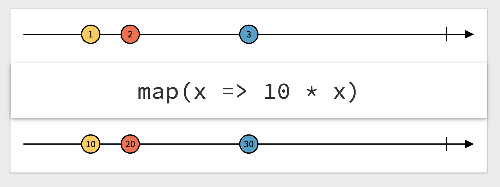

# Combine (Workshop 3)

## Opérateurs

Un opérateur est une méthode appliquée sur un publisher et qui retourne un nouveau publisher.

Exemple :
```swift
_ = (1 ... 6)
    .publisher
    .map { $0 * 2 }
    .sink { print($0) }
```

> ——— Example of: map ———  
> 2  
> 4  
> 6   
> 8  
> 10  
> 12  

Marble diagrams : https://rxmarbles.com/

Remarque : tous les example suivants fonctionnent avec

```swift
var subscriptions = Set<AnyCancellable>()
```



Marble diagrams est un site qui permet de comprendre les opérateurs en recative programming.

### Opérateurs de réduction

#### Collect

Collect permet de tranformer un flux d'évènements en Array.
```swift
["A", "B", "C", "D", "E"].publisher
    .collect()
    .sink { print($0) }
    .store(in: &subscriptions)
```

> ——— Example of: collect ———  
> ["A", "B", "C", "D", "E"]  

Attention, si on ne précise pas de chiffre dans `collect` alors il reprend tout le flux. On peut préciser le regroupement de la manière suivante : `collect(2)`.
```swift
["A", "B", "C", "D", "E"].publisher
    .collect(2)
    .sink { print($0) }
    .store(in: &subscriptions)
```

> ——— Example of: collect ———  
> ["A", "B"]  
> ["C", "D"]  
> ["E"]  

Si le publisher ne complete pas alors collect ne renvoie jamais rien !

Exemple :
```swift
let currentSubject = CurrentValueSubject<String, Never>("first")
currentSubject
    .collect()
    .sink(receiveCompletion: {
              print("Received completion", $0)
          },
          receiveValue: { print("Received", $0) })
    .store(in: &subscriptions)
currentSubject.send("second")
currentSubject.send(completion: .finished)
```

> ——— Example of: collect on subject ———  
> Received ["first", "second"]  
> Received completion finished  

Si on enlève la ligne `currentSubject.send(completion: .finished)` alors le subscriber ne reçoit jamais rien.
Si le publiser envoie une erreur alors le `collect` ne renverra aucune valeur (seulement l'erreur).

Il existe aussi une méthode `collect(_ strategy)`, qui permet de collecter les valeurs avec une stratégie sur le temps.

Exemple :
```swift
Timer.publish(every: 1, on: .main, in: .default)
    .autoconnect()
    .collect(.byTime(RunLoop.main, .seconds(5)))
    .sink { print("\($0)", terminator: "\n\n") }
    .store(in: &subscriptions)
```

> ——— Example of: collect By Time Strategy ———  
> [2021-03-17 13:44:19 +0000, 2021-03-17 13:44:20 +0000, 2021-03-17 13:44:21 +0000, 2021-03-17 13:44:22 +0000]  
> [2021-03-17 13:44:23 +0000, 2021-03-17 13:44:24 +0000, 2021-03-17 13:44:25 +0000, 2021-03-17 13:44:26 +0000, 2021-03-17 13:44:27 +0000]

#### Reduce

L'opérateur `reduce` permet de cumuler la valeur d'un évènement avec celle de l'évènement précédent et, comme `collect`, il produit le résultat à la completion du publisher (attention, en cas d'erreur, `reduce` ne produira rien, tout comme `collect`).

```swift
(0...10).publisher
    .reduce(0, { accum, next in accum + next })
    .sink { print("\($0)") }
    .store(in: &subscriptions)
```

> ——— Example of: reduce ———  
> 55

#### ignoreOutput

L'opérateur `ignoreOutput` permet de ne retourner que la completion (ou une erreur) en provenance d'un publisher en ignorant les valeurs éventuellement envoyées.

```swift
struct MyError: Error {}
(0 ... 10)
    .publisher
    .tryMap { value -> Int in
        if value > 5 {
            throw MyError()
        }
        return value
    }
    .ignoreOutput()
    .sink(receiveCompletion: { print("Received completion", $0) },
          receiveValue: { print($0) })
    .store(in: &subscriptions)
```

> ——— Example of: ignoreOutPut ———  
> Received completion failure(__lldb_expr_224.(unknown context at $10594901c).(unknown context at $105949058).(unknown context at $105949060).MyError())

Sans la ligne `.ignoreOutput()` on aurait obtenu :

> ——— Example of: ignoreOutPut ———  
> 0  
> 1  
> 2  
> 3  
> 4  
> 5  
> Received completion failure(__lldb_expr_226.(unknown context at $107ad901c).(unknown context at $107ad9058).(unknown context at $107ad9060).MyError())

### Opérateurs de mapping

#### Map

Map permet de transformer une valeur.
```swift
_ = (1 ... 6)
    .publisher
    .map { $0 * 2 }
    .sink { print($0) }
```
Ici on multiplie chaque valeur par 2.

> ——— Example of: map ———  
> 2  
> 4  
> 6   
> 8  
> 10  
> 12  

Dans cet autre exemple, on "mappe" un nombre vers une string. On notera que `[123, 4, 56].publisher` renvoie un `Publishers.Sequence<[Int], Never>` et qu'à la sortie du map on obtient un `Publishers.Sequence<[String], Never>`. Le `map` a changé le type d'output du publisher pas son type d'erreur.

```swift
let formatter = NumberFormatter()
formatter.numberStyle = .spellOut
[123, 4, 56]
    .publisher
    .map {
        formatter.string(for: NSNumber(integerLiteral: $0)) ?? ""
    }
    .sink(receiveValue: { print($0) })
    .store(in: &subscriptions)
```

Il existe aussi une méthode `map<T>`, qui permet de mapper des keypaths directement. C'est parfois utile quand on ne veut utiliser qu'une seule variable d'un objet (on peut aller jusqu'à un tuple de 3 : `map<T, U, V>`)

Exemple :
```swift
struct MyObject {
    let x: Int
    let y: Int
}
let subject = PassthroughSubject<MyObject, Never>()
subject
    .map(\.x, \.y)
    .sink { x, y in
        print(x, "-", y)
    }
    .store(in: &subscriptions)
subject.send(MyObject(x: 10, y:20))
```
Remarque : notez la nouvelle façon de pointer un keypath avec la notation `\.maVar`. Le Keypath permet de pointer une propriété d'un objet et pas sa valeur. En théorie, ici on aurait du écrire `\MyObject.x`, mais Swift sait inférer le type d'objet depuis le type du publisher.

`tryMap` est un opérateur qui, comme son nom l'indique, va "tenter" de mapper une valeur et s'il échoue va renvoyer une erreur sur le publisher.

Exemple :
```swift
enum MyError: Error {
    case noData
}
func convert(_ value: String) throws -> Data {
    guard let data = value.data(using: .utf8) else {
        throw MyError.noData
    }
    return data
}
struct MyObject: Decodable {
    let name: String
}
["{\"name\": \"Fred\"}", "4", "56"]
    .publisher
    .tryMap { try JSONDecoder().decode(MyObject.self, from: try convert($0)) }
    .sink(receiveCompletion: {
          print("Received completion", $0)
      },
      receiveValue: { print("Received", $0) })
    .store(in: &subscriptions)
```

Le résultat est intéressant :

> ——— Example of: tryMap ———  
> Received MyObject(name: "Fred")  
> Received completion failure(Swift.DecodingError.typeMismatch(Swift.Dictionary<Swift.String, Any>, Swift.DecodingError.Context(codingPath: [], debugDescription: "Expected to decode Dictionary<String, Any> but found a number instead.", underlyingError: nil)))

Le second decodage échoue, `tryMap` émet une erreur, le publisher s'arrète.

On trouve des `try` + `Method` pour de nombreux opérateurs en Combine (Exemple : `tryReduce`, `tryFilter`, `tryScan`, `tryMin`, etc).

#### Scan

L'opérateur `scan` permet de cumuler la valeur d'un évènement avec celle de l'évènement précédent.

```swift
(1...10)
    .publisher
    .scan(50) { $0 + $1 }
    .collect()
    .sink { print($0)}
    .store(in: &subscriptions)
```

> ——— Example of: scan ———  
> [51, 53, 56, 60, 65, 71, 78, 86, 95, 105]

Notez l'utilisation de `collect()` pour récupérer tout sur une seule ligne :-).

#### replaceNil

`replaceNil(with:)` permet de remplacer nil dans un publisher par la valeur de votre choix (identique au type d'output de votre publisher. Exemple : `Publisher<String?, Never>` => le remplacement se fera avec une `String`)

```swift
["A", nil, "C"].publisher
    .replaceNil(with: "-")
    .sink { print($0) }
    .store(in: &subscriptions)
```

> ——— Example of: replaceNil ———  
> Optional("A")  
> Optional("-")  
> Optional("C")

#### mapError

`mapError(_:)` : remplace le type d'erreur d'un publisher par un autre type d'erreur de votre choix.

```swift
enum MyError: Error {
    case stringHasNoData
    case decode(Error)
}
func convert(_ value: String) throws -> Data {
    guard let data = value.data(using: .utf8) else {
        throw MyError.stringHasNoData
    }
    return data
}
struct MyObject: Decodable {
    let name: String
}
["{\"name\": \"Fred\"}", "4", "56"]
    .publisher
    .tryMap { try JSONDecoder().decode(MyObject.self, from: try convert($0)) }
    .mapError { MyError.decode($0) }
    .sink(receiveCompletion: {
              print("Received completion", $0)
          },
          receiveValue: { print("Received", $0) })
    .store(in: &subscriptions)
```

#### setFailureType

`setFailureType(to:)` : remplace le type d'erreur d'un publisher dont le type d'erreur est `Never` par un autre type d'erreur de votre choix.  
Très intéressant quand vous devez combiner des publishers ayant des types d'erreurs différents par exemple, ou lorsque votre publisher non failable n'est pas compliant avec la signature d'une méthode imposée par un protocol (exemple : transformation d'un `Just`).

### Opérateurs de filtrage

#### filter

`filter(_:)` permet de filtrer le résultat d'un publisher.

```swift
(1...10)
    .publisher
    .filter { $0 % 2 == 0 }
    .collect()
    .sink { print($0) }
    .store(in: &subscriptions)
```

> ——— Example of: filter ———  
> [2, 4, 6, 8, 10]

#### replaceEmpty
  
Si un publisher se termine sans produire de valeur, vous pouvez remplacer cet "oubli" en utilisant `replaceEmpty(with:)`.

```swift
Empty<Int, Never>()
    .replaceEmpty(with: 100)
    .sink { print($0) }
receiveValue: { print($0) }
    .store(in: &subscriptions)
```

sans `.replaceEmpty(with: 100)`
> ——— Example of: replaceEmpty ———  
> finished

avec `.replaceEmpty(with: 100)`
> ——— Example of: replaceEmpty ———  
> 100  
> finished

### Opérateurs de republication par souscription à un nouveau Publisher

#### Flatmap

Voilà un opérateur intéressant, mais toujours évident à comprendre.  
Partons d'un exemple :  
Imaginons que vous attendiez le résultat d'un publisher pour ensuite créer un autre publisher et que vous souhaitiez vous abonner à ce dernier publisher.  
`flatmap` est là pour ça. Il va "écraser" les deux publishers en un seul.

```swift
["A", "B", "C", "D", "E"].publisher
    .collect(2)
    .flatMap { sequence in
        Just(sequence.joined(separator: "-"))
            .eraseToAnyPublisher()
    }
    .sink { print($0) }
    .store(in: &subscriptions)
```

> ——— Example of: Flatmap ———  
> A-B  
> C-D  
> E

Evidemment, cet exemple est très simple et il aurait pu être réalisé avec un map. Nous verrons l'intérêt de `flatmap` en utilisant les DataTaskPublisher qui permettent d'effectuer des appels vers des api.

L'exemple ci-dessus aurait aussi pu être écrit comme suit :

```swift
func join(_ sequence: [String]) -> AnyPublisher<String, Never> {
    Just(sequence.joined(separator: "-"))
        .eraseToAnyPublisher()
}
["A", "B", "C", "D", "E"].publisher
    .collect(2)
    .flatMap(join)
    .sink { print($0) }
    .store(in: &subscriptions)
```
Ce qui le rend encore plus élégant (à mon avis, mais c'est subjectif...)
Exercices :
- créer un distributeur de bonbons (un objet qui renvoie un bonbon lorsqu'on lui demande) avec un suivi parental (les parents sont avertis quand le distributeur a donné plus de x bonbons)
- créer un module qui permet d'avertir des gestionnaires en cas de dépassement bancaire
- créer un module qui permet d'appeler une api de manière asynchrone et de retourner le résultat de l'api (et de se compléter) ou une erreur
- utiliser le module précédent et permettre d'y injecter une api mockée qui renvoie une erreur ou juste résultat immédiatement.

## License
MIT
**Free Software, Hell Yeah!**