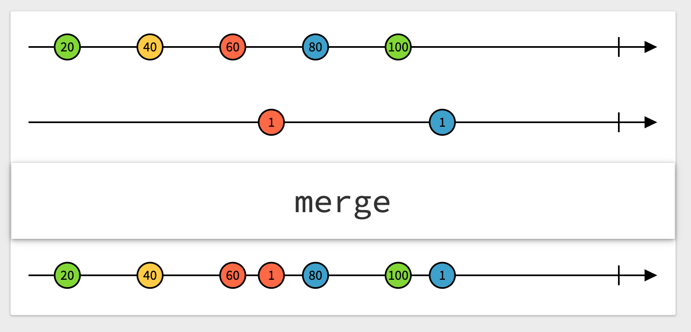

# Combine (Workshop 3)

## Opérateurs de republication

Suite de la présentation des opérateurs.

Nous allons parcourir les opérateurs de republication de stream.

Remarque : tous les example suivants fonctionnent avec

```swift
var subscriptions = Set<AnyCancellable>()
```
### Opérateurs de collecte et republication des derniers éléments provenant de publishers multiples

#### combineLatest(_:_:)


`combineLatest(_:_:)` prend les évènements d'un premier stream et les combine avec les évènements d'un autre stream.

```swift
let pub1 = PassthroughSubject<Int, Never>()
let pub2 = PassthroughSubject<Int, Never>()
pub1
    .combineLatest(pub2) { (first, second) in
        return first * second
    }
    .sink { print("Result: \($0).") }
    .store(in: &subscriptions)

pub1.send(1)
pub1.send(2)
pub2.send(2)
pub1.send(9)
pub1.send(3)
pub2.send(12)
pub1.send(13)
```

> ——— Example of: combineLatest ———  
> Result: 4.  
> Result: 18.  
> Result: 6.  
> Result: 36.  
> Result: 156.

Si l'un des streams échoue alors `combineLatest` échoue lui aussi.

#### merge(with:_:)


`merge(with:_:)` prend les évènements de streams multiples de même type et les renvoie sous forme d'un seul stream qui réagit à chaque évènements des streams d'origine.

```swift
let pubA = PassthroughSubject<Int, Never>()
let pubB = PassthroughSubject<Int, Never>()
let pubC = PassthroughSubject<Int, Never>()

pubA
    .merge(with: pubB, pubC)
    .sink { print("\($0)", terminator: " ") }
    .store(in: &subscriptions)

pubA.send(1)
pubB.send(40)
pubC.send(90)
pubA.send(2)
pubB.send(50)
pubC.send(100)
```

> ——— Example of: merge ———  
> 1 40 90 2 50 100 

Si l'un des streams échoue alors `merge` échoue lui aussi.

### Opérateurs de republication par souscription à un nouveau Publisher

#### Flatmap

Voilà un opérateur intéressant, mais toujours évident à comprendre.  
Partons d'un exemple :  
Imaginons que vous attendiez le résultat d'un publisher pour ensuite créer un autre publisher et que vous souhaitiez vous abonner à ce dernier publisher.  
`flatmap` est là pour ça. Il va "écraser" les deux publishers en un seul.

```swift
["A", "B", "C", "D", "E"].publisher
    .collect(2)
    .flatMap { sequence in
        Just(sequence.joined(separator: "-"))
            .eraseToAnyPublisher()
    }
    .sink { print($0) }
    .store(in: &subscriptions)
```

> ——— Example of: Flatmap ———  
> A-B  
> C-D  
> E

Evidemment, cet exemple est très simple et il aurait pu être réalisé avec un map. Nous verrons l'intérêt de `flatmap` en utilisant les DataTaskPublisher qui permettent d'effectuer des appels vers des api.

L'exemple ci-dessus aurait aussi pu être écrit comme suit :

```swift
func join(_ sequence: [String]) -> AnyPublisher<String, Never> {
    Just(sequence.joined(separator: "-"))
        .eraseToAnyPublisher()
}
["A", "B", "C", "D", "E"].publisher
    .collect(2)
    .flatMap(join)
    .sink { print($0) }
    .store(in: &subscriptions)
```
Ce qui le rend encore plus élégant (à mon avis, mais c'est subjectif...)