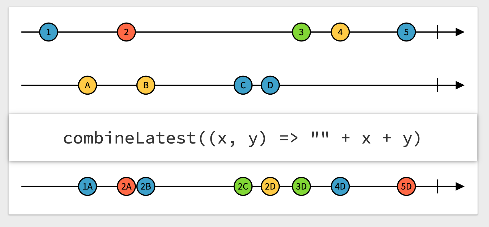

# Combine (Workshop 3)

## Opérateurs de republication/merge

Suite de la présentation des opérateurs.

Nous allons parcourir les opérateurs de republication de stream.

Remarque : tous les example suivants fonctionnent avec

```swift
var subscriptions = Set<AnyCancellable>()
```
### Opérateurs de collecte et republication des derniers éléments provenant de publishers multiples

#### combineLatest(_:_:)


`combineLatest(_:_:)` prend les évènements d'un premier stream et les combine avec les évènements d'un autre stream.

```swift
let pub1 = PassthroughSubject<Int, Never>()
let pub2 = PassthroughSubject<Int, Never>()
pub1
    .combineLatest(pub2) { (first, second) in
        return first * second
    }
    .sink { print("Result: \($0).") }
    .store(in: &subscriptions)

pub1.send(1)
pub1.send(2)
pub2.send(2)
pub1.send(9)
pub1.send(3)
pub2.send(12)
pub1.send(13)
```

> ——— Example of: combineLatest ———  
> Result: 4.  
> Result: 18.  
> Result: 6.  
> Result: 36.  
> Result: 156.

Si l'un des streams échoue alors `combineLatest` échoue lui aussi.

#### merge(with:_:)


`merge(with:_:)` prend les évènements de streams multiples de même type et les renvoie sous forme d'un seul stream qui réagit à chaque évènement des streams d'origine.

```swift
let pubA = PassthroughSubject<Int, Never>()
let pubB = PassthroughSubject<Int, Never>()
let pubC = PassthroughSubject<Int, Never>()

pubA
    .merge(with: pubB, pubC)
    .sink { print("\($0)", terminator: " ") }
    .store(in: &subscriptions)

pubA.send(1)
pubB.send(40)
pubC.send(90)
pubA.send(2)
pubB.send(50)
pubC.send(100)
```

> ——— Example of: merge ———  
> 1 40 90 2 50 100 

Si l'un des streams échoue alors `merge` échoue lui aussi.

#### zip(_:)


`zip(_:)` prend les évènements de streams multiples et les renvoie sous forme d'un seul stream qui couple les évènements des streams sous forme de tuple.

```swift
let numbersPub = PassthroughSubject<Int, Never>()
let lettersPub = PassthroughSubject<String, Never>()

numbersPub.sink { print("numbersPub : \($0)") }
    .store(in: &subscriptions)
lettersPub.sink { print("lettersPub : \($0)") }
    .store(in: &subscriptions)

numbersPub
    .zip(lettersPub)
    .sink { print("zip: \($0)") }
    .store(in: &subscriptions)

numbersPub.send(1)
numbersPub.send(2)
lettersPub.send("A")
numbersPub.send(3)
lettersPub.send("B")
```

> ——— Example of: zip ———  
> numbersPub : 1  
> numbersPub : 2 
> zip: (1, "A")  
> lettersPub : A  
> numbersPub : 3  
> zip: (2, "B")  
> lettersPub : B


Si l'un des streams échoue alors `zip` échoue lui aussi.

### Opérateurs de republication par souscription à un nouveau Publisher

#### Flatmap

Voilà un opérateur intéressant, mais pas toujours évident à comprendre.  
Partons d'un exemple :  
Imaginons que vous attendiez le résultat d'un publisher pour ensuite créer un autre publisher et que vous souhaitiez vous abonner à ce dernier publisher.  
`flatmap` est là pour ça. Il va "écraser" les deux publishers en un seul.

```swift
["A", "B", "C", "D", "E"].publisher
    .collect(2)
    .flatMap { sequence in
        Just(sequence.joined(separator: "-"))
            .eraseToAnyPublisher()
    }
    .sink { print($0) }
    .store(in: &subscriptions)
```

> ——— Example of: Flatmap ———  
> A-B  
> C-D  
> E

Evidemment, cet exemple est très simple et il aurait pu être réalisé avec un map. Nous verrons l'intérêt de `flatmap` en utilisant les DataTaskPublisher qui permettent d'effectuer des appels vers des api.

L'exemple ci-dessus aurait aussi pu être écrit comme suit :

```swift
func join(_ sequence: [String]) -> AnyPublisher<String, Never> {
    Just(sequence.joined(separator: "-"))
        .eraseToAnyPublisher()
}
["A", "B", "C", "D", "E"].publisher
    .collect(2)
    .flatMap(join)
    .sink { print($0) }
    .store(in: &subscriptions)
```
Ce qui le rend encore plus élégant (à mon avis, mais c'est subjectif...)

#### switchToLatest()

`switchToLatest()` est considéré comme l'opérateur le plus complexe à comprendre (ce avec quoi je ne suis pas d'accord... je pense que `multicast` est plus compliqué...). `switchToLatest()` republie les évènements du dernier publisher sélectionné, le tout sous la forme d'un seul publisher. C'est intéressant quand on veut changer de publisher durant le lifecycle.

Attention, les publishers ne doivent pas émettre d'erreur (ErrorType à Never).

```swift
let publisher1 = PassthroughSubject<Int, Never>()
let publisher2 = PassthroughSubject<Int, Never>()
let publisher3 = PassthroughSubject<Int, Never>()

let publishers = PassthroughSubject<PassthroughSubject<Int, Never>, Never>()

publishers
    .switchToLatest()
    .sink(receiveCompletion: { _ in print("Completed!") },
          receiveValue: { print($0) })
    .store(in: &subscriptions)

publishers.send(publisher1)
publisher1.send(1)
publisher1.send(2)

publishers.send(publisher2)
print("-> publisher1.send(3)")
publisher1.send(3)
publisher2.send(4)
publisher2.send(5)

publishers.send(publisher3)
print("-> publisher2.send(6)")
publisher2.send(6)
publisher3.send(7)
publisher3.send(8)
publisher3.send(9)

print("-> publisher3.send(completion: .finished)")
publisher3.send(completion: .finished)
publishers.send(completion: .finished)
```

> ——— Example of: combineLatest ———  
> 1  
> 2  
> -> publisher1.send(3)  
> 4  
> 5  
> -> publisher2.send(6)  
> 7  
> 8  
> 9  
> -> publisher3.send(completion: .finished)  
> Completed!

## Exercices :

- un producteur produit des fraises. Il émet un évènement à chaque production d'un paquet de fraises. Un sale capitaliste les révend sur le marché uniquement quand le marché émet un taux supérieur ou égal à 2 et pour calculer son bénéfice, il multiplie un paquet par le taux. Réaliser un stream qui publie son bénéfice cumulé.
- utiliser le résultat d'un webservice pour pouvoir appeler un autre webservice dans la foulée.
- il faut trois pièces distinctes pour produire un jouet. Ces trois pièces sont produites de manière asynchrone. Emettre un évènement lorsqu'il est possible de produire un jouet.
- une équipe de cuisiniers se succèdent et produisent des plats. En salle on récupère ces plats en émettant un signal. Réaliser ce scénario en Combine.

## License
MIT
**Free Software, Hell Yeah!**