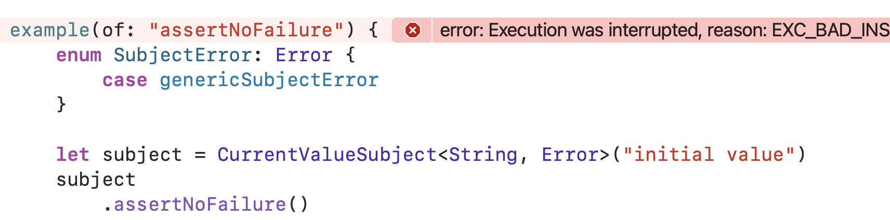

# Combine (Workshop 3)

## Opérateurs divers (timing, error, decoding)

Suite de la présentation des opérateurs.

Remarque : tous les example suivants fonctionnent avec

```swift
var subscriptions = Set<AnyCancellable>()
```
### Opérateurs de gestion d'erreurs

#### assertNoFailure(_:file:line:)

`assertNoFailure(_:file:line:)` correspond à un `fatalerror` dans le monde impératif.

```swift
enum SubjectError: Error {
    case genericSubjectError
}

let subject = CurrentValueSubject<String, Error>("initial value")
subject
    .assertNoFailure()
    .sink(receiveCompletion: { print ("completion: \($0)") },
          receiveValue: { print ("value: \($0).") }
    )
    .store(in: &subscriptions)

subject.send("second value")
subject.send(completion: .failure(SubjectError.genericSubjectError))
```


> ——— Example of: assertNoFailure ———  
> value: initial value.  
> value: second value.

#### catch(_:)

`catch(_:)` transforme une erreur dans un stream en un autre publisher.

```swift
struct SimpleError: Error {}
let numbers = [5, 4, 3, 2, 1, 0, 9, 8, 7, 6]
numbers.publisher
    .tryLast(where: {
        guard $0 != 0 else {throw SimpleError()}
        return true
    })
    .catch({ _ in
        Just(-1)
    })
    .sink(receiveCompletion: { print($0) }, receiveValue: {
        print("received", $0)
    })
    .store(in: &subscriptions)
```

> ——— Example of: catch ———  
> received -1  
> finished 

Sans le catch, on aurait obtenu juste une completion sur une erreur.

> failure(__lldb_expr_7.(unknown context at $10f38261c).(unknown context at $10f382660).(unknown context at $10f382668).SimpleError())  

Il existe aussi `tryCatch(_:)` qui fait la même chose que `catch(_:)` mais permet aussi de thrower une erreur si nécessaire.

#### retry(_:)

`retry(_:)` permet d'essayer plusieurs fois une souscription si le publisher échoue.

```swift
struct SimpleError: Error {}
let numbersPub = PassthroughSubject<Int, SimpleError>()
numbersPub
    .print("publisher")
    .retry(2)
    .sink(receiveCompletion: { print($0) },
                receiveValue: { print("numbersPub : \($0)") })
    .store(in: &subscriptions)
numbersPub.send(completion: .failure(SimpleError()))
```

> ——— Example of: retry ———  
> publisher: receive subscription: (PassthroughSubject)  
> publisher: request unlimited  
> publisher: receive error: (SimpleError())  
> publisher: receive subscription: (Empty)  
> publisher: request unlimited  
> publisher: receive error: (SimpleError())  
> publisher: receive subscription: (Empty)  
> publisher: request unlimited  
> publisher: receive error: (SimpleError())  
> failure(__lldb_expr_21.(unknown context at $111b7677c).(unknown context at $111b767f8).(unknown context at $111b76800).SimpleError())

On constate avec le `print` que la souscription est demandée 2 fois.

### Opérateurs de timing

#### measureInterval(using:options:)

`measureInterval(using:options:)` mesure le temps entre deux évènements d'un stream en utilisant la méthode `now` du Scheduler défini.

```swift
Timer.publish(every: 1, on: .main, in: .default)
    .autoconnect()
    .measureInterval(using: RunLoop.main)
    .sink { print("\($0)", terminator: "\n") }
    .store(in: &subscriptions)
```

> ——— Example of: measureInterval ———  
> Stride(magnitude: 1.0013329982757568)  
> Stride(magnitude: 0.9999380111694336)

#### debounce(for:scheduler:options:)

`debounce(for:scheduler:options:)` permet de diffuser les évènements d'un stream seulement si l'écart de temps entre deux évènements respecte un certain temps.

```swift
let bounces: [(Int, TimeInterval)] = [
    (0, 0),
    (1, 0.25), // 0.25s interval since last index
    (2, 1), // 0.75s interval since last index
    (3, 1.25), // 0.25s interval since last index
    (4, 1.5), // 0.25s interval since last index
    (5, 2), // 0.5s interval since last index
]

let subject = PassthroughSubject<Int, Never>()
subject
    .debounce(for: .seconds(0.5), scheduler: RunLoop.main)
    .sink { index in
        print("Received index \(index)", CFAbsoluteTimeGetCurrent())
    }
    .store(in: &subscriptions)

for bounce in bounces {
    DispatchQueue.main.asyncAfter(deadline: .now() + bounce.1) {
        print("send index", bounce.0, CFAbsoluteTimeGetCurrent())
        subject.send(bounce.0)
    }
}
```

> ——— Example of: debounce ———  
> send index 0 640188991.829604  
> send index 1 640188992.079785  
> Received index 1 640188992.580735  
> send index 2 640188992.900728  
> send index 3 640188993.178848  
> send index 4 640188993.4518  
> Received index 4 640188993.952709  
> send index 5 640188994.005742  
> Received index 5 640188994.506935

#### delay(for:tolerance:scheduler:options:)

`delay(for:tolerance:scheduler:options:)` diffuse les évènements d'un stream avec un delay indiqué dans la méthode. Si l'évènement est émis à x, alors suite au delay, l'évènement sera émis à x + temps du delay.

```swift
let subject = PassthroughSubject<Int, Never>()
subject
    .delay(for: .seconds(3), scheduler: RunLoop.main)
    .sink(receiveCompletion: { print($0, CFAbsoluteTimeGetCurrent()) },
          receiveValue: { print($0, CFAbsoluteTimeGetCurrent()) })
    .store(in: &subscriptions)

DispatchQueue.main.asyncAfter(deadline: .now() + 2) {
    print("send value", CFAbsoluteTimeGetCurrent())
    subject.send(0)
}
DispatchQueue.main.asyncAfter(deadline: .now() + 2) {
    print("send completion", CFAbsoluteTimeGetCurrent())
    subject.send(completion: .finished)
}
```

> ——— Example of: delay ———  
> send value 640512142.003449  
> send completion 640512142.004398  
> 0 640512145.003709  
> finished 640512145.004582

Ici, même l'évènement de completion est reçu avec un delay de 3 secondes.

#### throttle(for:scheduler:latest:)

`throttle(for:scheduler:latest:)` publie le plus récent ou le premier évènement émis par le stream durant une période sépcifiée. Il élimine les autres évènements.

```swift
Timer.publish(every: 3.0, on: .main, in: .default)
    .autoconnect()
    .throttle(for: 10.0, scheduler: RunLoop.main, latest: true)
    .sink(
        receiveCompletion: { print("Completion: \($0).") },
        receiveValue: { print("Received Timestamp \($0).") }
    ).store(in: &subscriptions)
```

> ——— Example of: throttle ———  
> Received Timestamp 2021-04-19 08:15:33 +0000.  
> Received Timestamp 2021-04-19 08:15:42 +0000.  
> Received Timestamp 2021-04-19 08:15:51 +0000.

Ici, le Timer émet toutes les 3 secondes mais le throttling émet toutes les 10 secondes.

#### timeout(_:scheduler:options:customError:)

`timeout(_:scheduler:options:customError:)` termine un stream si celui-ci n'émet pas d'évènement avant l'intervalle de temps défini.

```swift
let subject = PassthroughSubject<Int, Never>()
subject
    .timeout(.seconds(3), scheduler: RunLoop.main)
    .sink(receiveCompletion: { print($0, CFAbsoluteTimeGetCurrent()) },
          receiveValue: { print($0, CFAbsoluteTimeGetCurrent()) })
    .store(in: &subscriptions)

DispatchQueue.main.asyncAfter(deadline: .now() + 10) {
    print("send value", CFAbsoluteTimeGetCurrent())
    subject.send(0)
}
```

> ——— Example of: timeout ———  
> finished 641288240.329973  
> send value 641288247.333049

La valeur est envoyée après le timeout qui se termine donc avant est n'émet qu'un event de completion.

### Opérateurs de decodage/encodage

#### decode(type:decoder:)

`decode(type:decoder:)` permet de decoder des data en utilisant un decoder spécifique.

```swift
struct Article: Codable {
    let title: String
    let author: String
    let pubDate: Date
}

let dataProvider = PassthroughSubject<Data, Never>()
dataProvider
    .decode(type: Article.self, decoder: JSONDecoder())
    .sink(receiveCompletion: { print ("Completion: \($0)")},
          receiveValue: { print ("value: \($0)") })
    .store(in: &subscriptions)

dataProvider.send(Data("{\"pubDate\":1574273638.575666, \"title\" : \"My First Article\", \"author\" : \"Gita Kumar\" }".utf8))
```

> ——— Example of: decode ———  
> value: Article(title: "My First Article", author: "Gita Kumar", pubDate: 2050-11-20 18:13:58 +0000)

Ici on utilise un JsonDecoder, mais on peut utiliser un autre decoder tant qu'il implémente `TopLevelDecoder`.

#### encode(encoder:)

`encode(encoder:)` permet d'encoder un élément en utilisant l'encoder spécifié.

```swift
struct Article: Codable {
    let title: String
    let author: String
    let pubDate: Date
}

let dataProvider = PassthroughSubject<Article, Never>()
dataProvider
    .encode(encoder: JSONEncoder())
    .sink(receiveCompletion: { print ("Completion: \($0)") },
          receiveValue: {  data in
            guard let stringRepresentation = String(data: data, encoding: .utf8) else { return }
            print("Data received \(data) string representation: \(stringRepresentation)")
    })
    .store(in: &subscriptions)

dataProvider.send(Article(title: "My First Article", author: "Gita Kumar", pubDate: Date()))
```

> ——— Example of: encode ———  
> Data received 79 bytes string representation: {"title":"My First Article","author":"Gita Kumar","pubDate":641288845.18136895}

Ici on utilise un JsonEncoder, mais on peut utiliser un autre encoder tant qu'il implémente `TopLevelEncoder`.

### Opérateurs de partage

#### share()

`share()` permet de partager un publisher entre plusieurs subscribers.

Remarque d'Apple : Publishers.Share is effectively a combination of the Publishers.Multicast and PassthroughSubject publishers, with an implicit autoconnect().

```swift
let pub = (1...3).publisher
    .delay(for: 1, scheduler: DispatchQueue.main)
    .map( { _ in return Int.random(in: 0...100) } )
    .print("Random")
    .share()

pub
    .sink { print ("Stream 1 received: \($0)")}
    .store(in: &subscriptions)
pub
    .sink { print ("Stream 2 received: \($0)")}
    .store(in: &subscriptions)
```

> ——— Example of: share ———  
> Stream 1 received: 41  
> Stream 2 received: 41  
> Stream 1 received: 49  
> Stream 2 received: 49  
> Stream 1 received: 70  
> Stream 2 received: 70

Ici on utilise un delay pour que le publisher ne soit pas vidé par le premier subscriber. Si on n'avait pas utilisé `share` chaque subscriber aurait reçu un nombre aléatoire différent.

## License
MIT
**Free Software, Hell Yeah!**